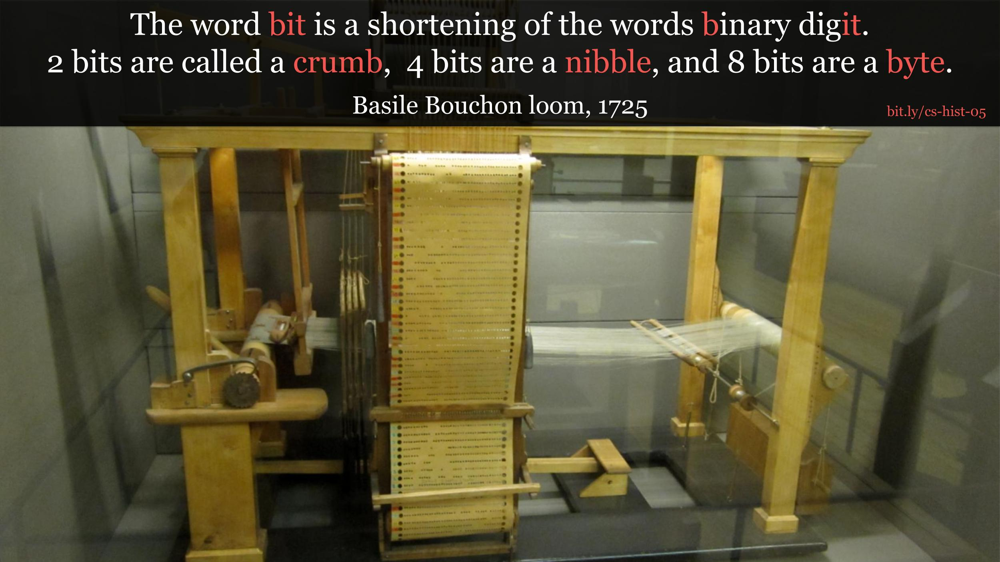

# Bits, Crumbs, Nibbles, & Bytes

## Units of Information

A bit is a binary digit represented by a `0` or `1`. Several units are [derived
from bits.](https://en.wikipedia.org/wiki/Units_of_information#Units_derived_from_bit)
Of these, `crumb`, `nibble`, and `byte` stand out for their amazing puns.

### octets (8-bit byte)

In the early days of computing bytes were commonly 6-bit or 9-bit. The [octet](https://en.wikipedia.org/wiki/Octet_%28computing%29)
or 8-bit byte, was adopted after [IBM's System/360](https://en.wikipedia.org/wiki/IBM_System/360) line of computers.

**IBM System 360**

## Basile Bouchon Loom

The [loom created by Basile Bouchon](https://en.wikipedia.org/wiki/Basile_Bouchon) was one of the first uses of binary data. It
took instructions determined by holes in paper. Where two states, 1) not having a
hole in the paper or 2) having a hole in the paper could be used to weave
patterns in textiles.

## References
* [Basile Bouchon Image Source](https://commons.wikimedia.org/wiki/File:Basile_Bouchon_1725_loom.jpg)
* [System 360 Image Source](https://en.wikipedia.org/wiki/File:IBM_System_360_model_30_profile.agr.jpg)
