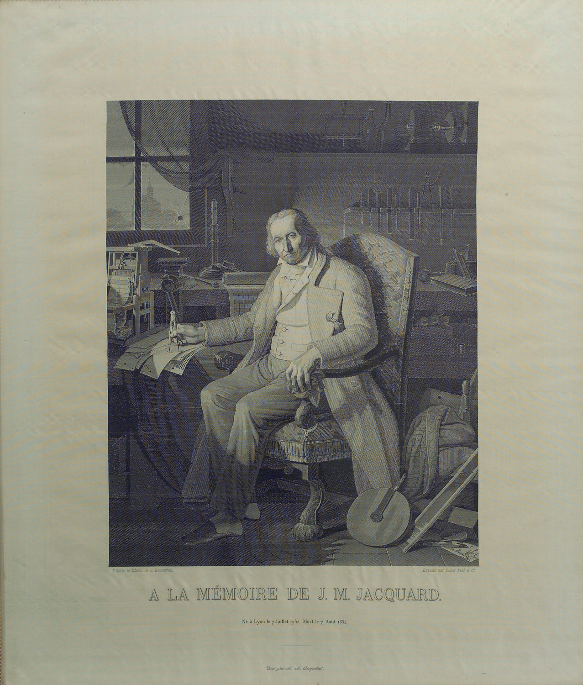

# Jacquard Loom

The [Jacquard loom](https://en.wikipedia.org/wiki/Jacquard_loom) was used to weave intricate textiles using punch cards to help
automate the process. Automation via punch cards was crucial for Babbage's design
of the Analyical Engine. As such, the Jacquard Loom is frequently referenced in
[The Sketch of The Analytical Engine](bit.ly/cs-hist-02).

## Interesting Facts
Below is a self portrait of Joseph Jacquard woven in silk on a Jacquard loom.

Charles Babbage was so fascinated by the portrait that he actually owned a copy.

> Babbage was much taken with the portrait, which is so fine that it is difficult to tell with the naked eye that it is woven rather than engraved. He hung his own copy of the prized portrait in his drawing room and used it to explain his use of the punched cards in his Engine. The delicate shading, crafted shadows and fine resolution of the Jacquard portrait challenged existing notions that machines were incapable of subtlety. Gradations of shading were surely a matter of artistic taste rather than the province of machinery, and the portrait blurred the clear lines between industrial production and the arts. [1]

## References
* [1] Swade, The Cogwheel Brain. Charles Babbage and the Quest to Build the First Computer [2000] 107-8
* [Cloth Facing Image Source](https://tissura.com/articles/jacquard-fabrics)
* [Punch Card Facing Image Source](http://addiator.blogspot.com/2011/10/jacquards-loom-and-stored-programme.html)
* [Woven Self Portrait Image Source](https://www.metmuseum.org/toah/works-of-art/31.124/)
