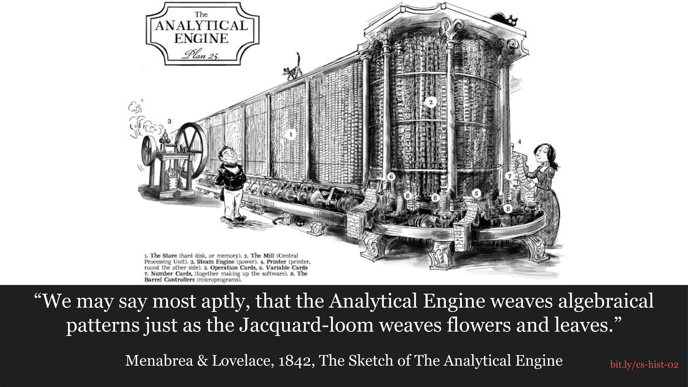

# Weaving Algebraical Patterns

In 1837, Charles Babbage first described the [Analytical Engine](https://en.wikipedia.org/wiki/Analytical_Engine) which would have been the first general purpose computer..
Unfortunately, it was never built, but the design was documented by Luigi
Menabrea and Ada Lovelace in the 1842 paper "The Sketch of The Analytical Engine."

Menabrea and Lovelace are great authors who do a great job at describing how the
difference engine and analytical engines work. I'd highly suggest reading the
paper.

## References
* [Image Source](https://sydneypadua.com/2dgoggles/the-marvellous-analytical-engine-how-it-works/)
* [The Sketch of the Analytical Engine PDF](http://www.fourmilab.ch/babbage/sketch.html)
* [Annotated: The Sketch of the Analytical Engine](https://dochub.com/benjenkinsv95/7Vm6qg/menabrea-and-lovelace-1842-sketch-of-the-analytical-engine?dt=rdsA_HhwJj7Czwh2DowY)
