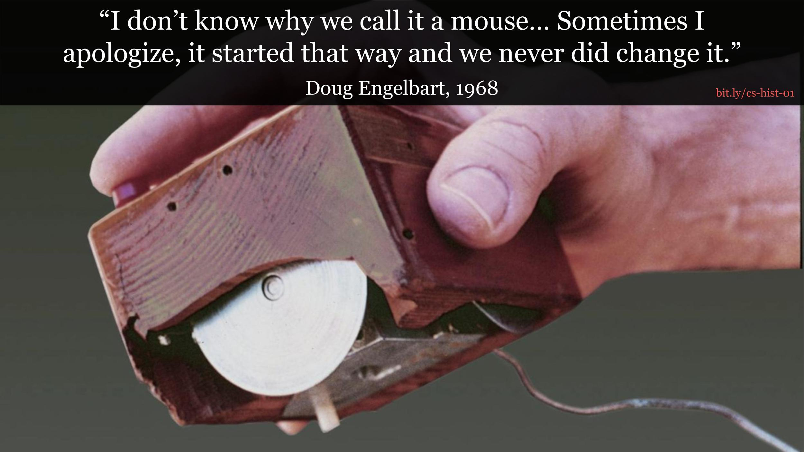

# Mouse Origin

The first mouse was shown at the ["Mother of All Demos"](https://en.wikipedia.org/wiki/The_Mother_of_All_Demos) by Doug Engelbart.

The demo showcased
* The first computer mouse
* A two way live video stream from 30 miles away
* Clicking on links and going to another page, demonstrating hypertext.

### The Mother of All Demos Recording

#### Interesting Fact
The mouse was actually invented after the first stylus! The first stylus, invented around 1955, was called the [light pen](https://en.wikipedia.org/wiki/Light_pen).

## References
* Image Source: https://mashable.com/article/mother-of-all-demos-douglas-engelbart-50-years/
