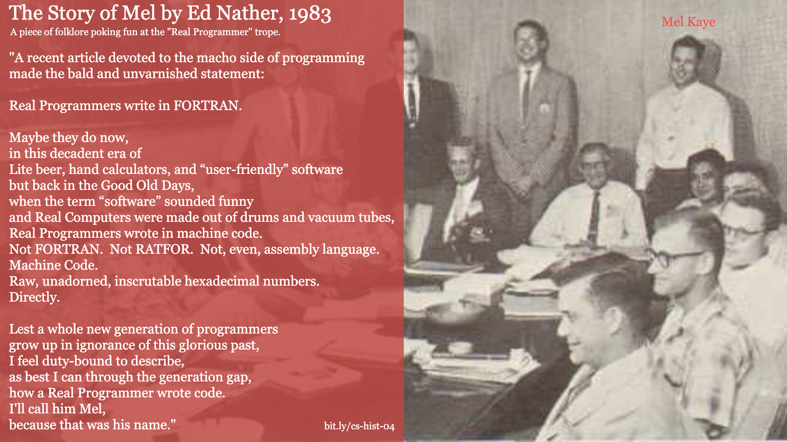
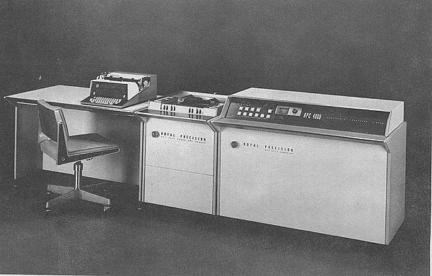

# Folklore: The Story of Mel

[The Story of Mel](http://www.catb.org/~esr/jargon/html/story-of-mel.html) was written by Ed Nather in 1983. It is satire poking fun at the "Real Programmer" myth/trope.

The story describes Mel's attempt to port a blackjack program from the LGP-30 to the RPC-4000 and the ethical dilemnas that arose.

## Oral Tradition in Software

Before reading The Story of Mel, I highly recommend Bryan Cantrill's excelent video covering [Oral Tradition in Software.](https://www.youtube.com/watch?v=4PaWFYm0kEw&feature=youtu.be&t=534)

### RPC 4000

## References
* Mel Kaye Image Source: Group photo from the August 1956 Librazette
* [RPC 4000 Image Source](http://www.e-basteln.de/computing/rpc4000/rpc4000/)
