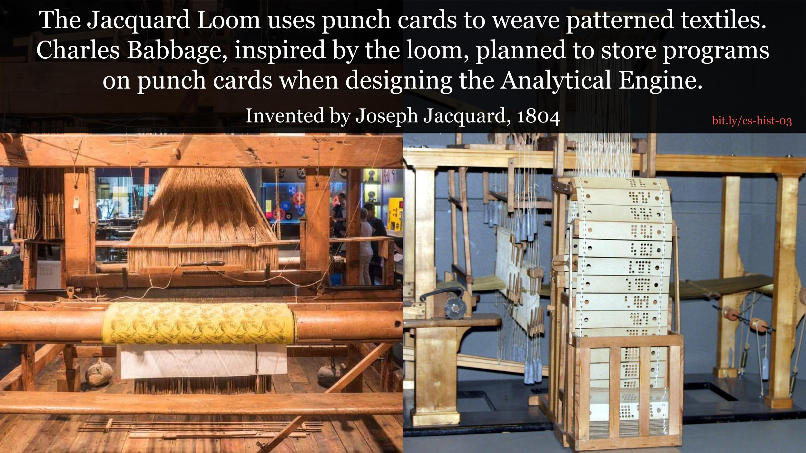
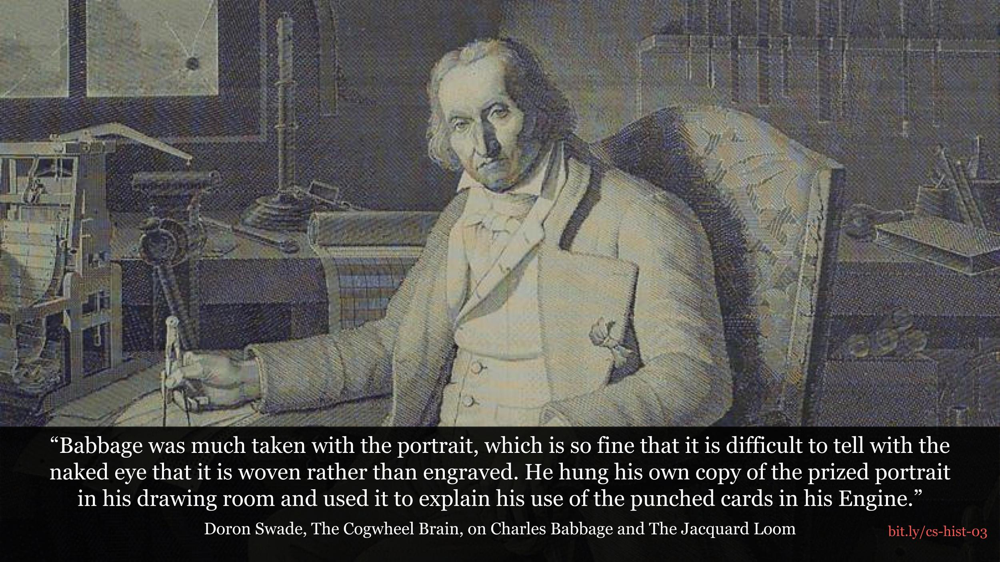

# Computer Science History Backgrounds

Here are a collection of backgrounds I've created to help spark interest in Computer Science.
I leave them on the projector during breaks so that students can learn some of the
weirder and fun parts of computer science history. Here's a small sampling.

#### 1804 - The Jacquard Loom

#### 1842 - The Analytical Engine

#### 1968 - The First Computer Mouse

