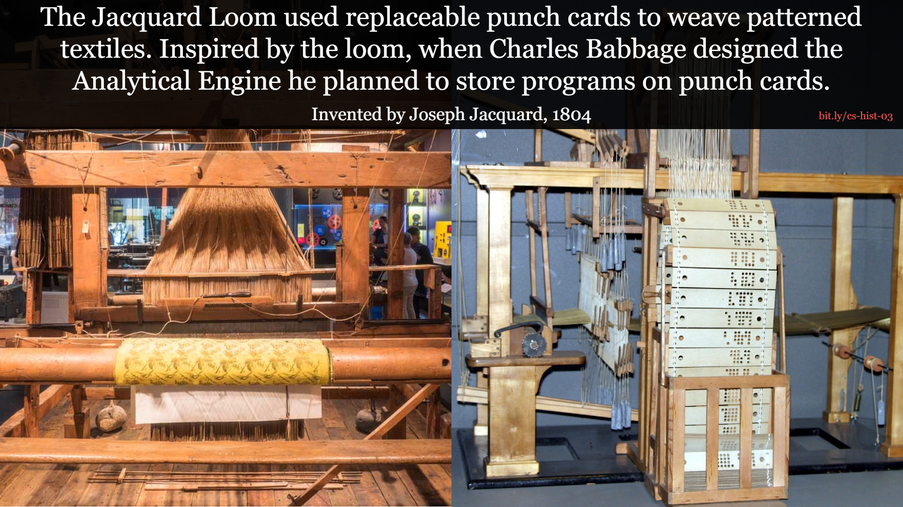
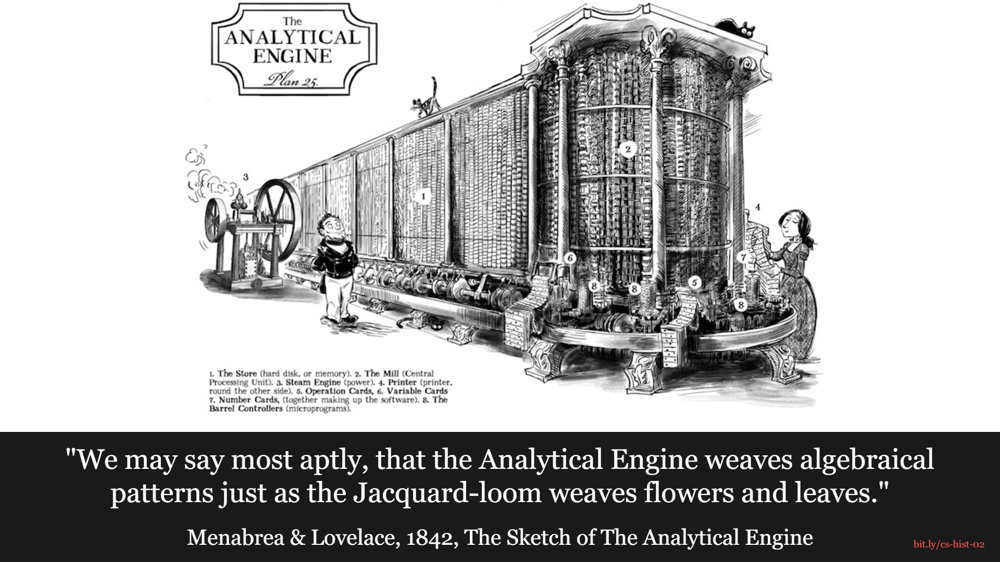
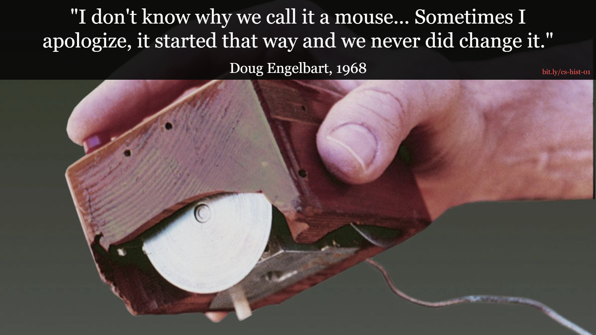

# Computer Science History Backgrounds

Here are a collection of backgrounds I've created to help spark interest in Computer Science.
I leave them on the projector during breaks so that students can learn some of the
weirder and fun parts of computer science history. Here's a small sampling.

### The Jacquard Loom

### The Analytical Engine

### The First Computer Mouse

